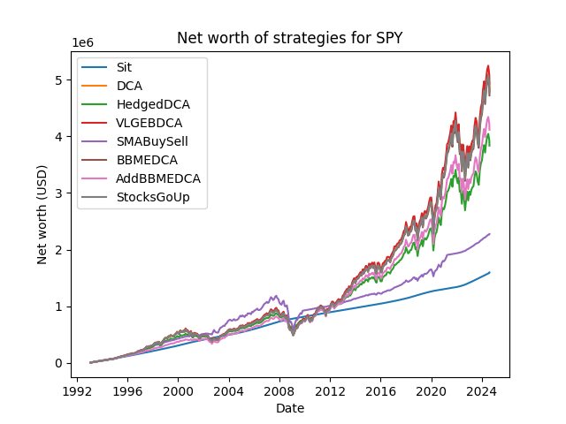
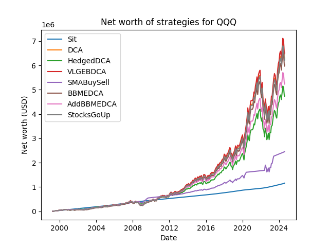
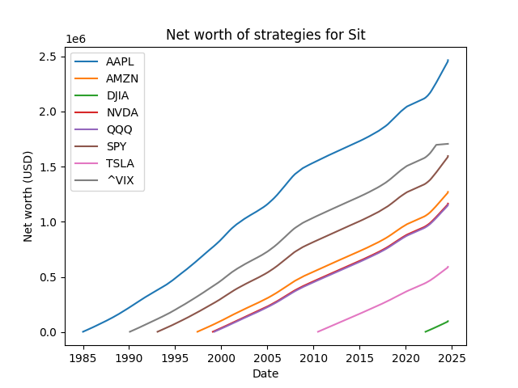

# Financial Documentation

NOTE: None of what is written here is financial advice, and it's probably not
even correct financial reading material. It's simply my interpretation of what's
going on in these backtests.

NOTE 2: These are investing backtests, and past performance is not necessarily
indicative of future results. For a more detailed breakdown on why that is the
case, check out [this video](https://www.youtube.com/watch?v=jm55pm_ZIdI).

## Overall results

The following is a graph of overall results for various strategies on $SPY,
which is the index fund (ETF) for the S&P 500.

The following is a graph of results for strategies on $QQQ.

## Breakdowns of individual strategy

### Sit: Probably a bad idea for your money

The Sit strategy consists of taking monthly income and throwing it in a money
market fund. For these graphs, I've taken historical data of federal/treasury
return rates as a close-enough stand-in for money market yield rates. Treasury
bonds or other things should yield roughly the same, but in bull markets, very
generally, money market funds outperform treasury bonds whilst being more
liquid. Notably, money market funds also outperform HYSAs, making them a fairly
good candidate.

The Sit strategy actually outperforms other strategies in times of significant
recession, as you don't _lose_ money while sitting on it. However, notably, once
you have enough money as a cushion to absorb losses, sitting underperforms other
strategies significantly, and in a long enough term, it underperforms vastly.

### DCA: What people tell you to do

Dollar Cost Averaging (DCA) is a technique used to perform better in a market
scenario by simply (and blindly) throwing fixed amounts of money, monthly, into
the market, regardless of its performance. You incur gains and losses relative
to the market, but over time, if the underlying stock increases your portfolio
increases.

From a mathematical perspective, a crude approximation of a cyclical market is
that of a sinusoidal wave (with changing phase, changing frequency - The point
is, it's sinusoidal) and an additional baseband component. This baseband
component generically goes up in financial markets, as the value of things
consistently goes up. In other terms, as more technology develops and life
becomes easier, the average value of things goes up, and so too should a
financial market.

Unlike Sit, which most closely follows the "baseband" component of value going
up, DCA leverages the fact that the market is largely cyclical and applies that
to the stock by simply buying no matter what. If the market is a sinusoidal
pattern, by taking the average of that curve, you get a root-mean-squared (RMS)
value on top of the ever-increasing baseband, which is additional profit. In
practice, this can be reinvested for significant gains.

### Hedged DCA: Interesting results

Oftentimes financial investors will advise people to hedge their investments
against negative market movements. For this simulation, I've chosen a 70%/30%
split, where 70% of income is DCA'd flat into stocks, and the remainder 30% is
added to bank balance, where it slowly increases over time. Notably, this
strategy underperforms flat dollar cost averaging in almost every time period.

The time period of note where this strategy underperformed was actually shortly
after 2008, which was during the housing crisis. In times of extreme recession,
hedging bets with higher treasury build-up seemed like a very valuable play
compared to continually investing.

However, I think a possible explanation for this may stem from the fact that the
total amount in the investment account was not very large. As a huge bull run
occurred between the years of 2010 and now, smaller recessionary periods seemed
to be significantly less effective on overall net worth as a result. As such, I
think hedging doesn't seem like a very strong choice, _assuming stocks continue
to go up._

I'll still probably hedge my bets (a little less) anyways, as the bull run we
just experienced looks a little too good to replicate itself.
