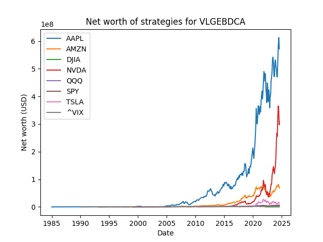

# Financial Documentation

NOTE: None of what is written here is financial advice, and it's probably not
even correct financial reading material. It's simply my interpretation of what's
going on in these backtests.

NOTE 2: These are investing backtests, and past performance is not necessarily
indicative of future results. For a more detailed breakdown on why that is the
case, check out [this video](https://www.youtube.com/watch?v=jm55pm_ZIdI).

**The overall takeaway and TL;DR of this project** is that time in the market is
significantly better than timing the market. Like, almost always.

## Overall results

The following is a graph of overall results for various strategies on $SPY,
which is the index fund (ETF) for the S&P 500.


The following is a graph of results for strategies on $QQQ.


And for the Dow Jones, DJIA:


### Normalization

To better demonstrate profits and losses, I've normalized each strategy against
the simple "Sit" strategy (which is basically just money market return rates).

Here is one for $SPY:


Here is one for $QQQ:


And for the Dow Jones, DJIA:


I also normalized the strategies to DCA, just to demonstrate how bad some of
these strategies are compared to blindly throwing money at the market.

Here is one for $SPY:


Here is one for $QQQ:


And for the Dow Jones, DJIA:


### Other stocks

Just for curiosity's sake, I also ran the values with individual stocks. Here
are the normalized graphs, compared to sitting on money in money market. All
graphs are in the `graphs/` folder.

Here is Apple:


For Amazon:


For Tesla:


For NVIDIA:


## Breakdowns of individual strategy

### Sit: Probably a bad idea for your money


The Sit strategy consists of taking monthly income and throwing it in a money
market fund. For these graphs, I've taken historical data of federal/treasury
return rates as a close-enough stand-in for money market yield rates. Treasury
bonds or other things should yield roughly the same, but in bull markets, very
generally, money market funds outperform treasury bonds whilst being more
liquid. Notably, money market funds also outperform HYSAs, making them a fairly
good candidate.

The Sit strategy actually outperforms other strategies in times of significant
recession, as you don't _lose_ money while sitting on it. However, notably, once
you have enough money as a cushion to absorb losses, sitting underperforms other
strategies significantly, and in a long enough term, it underperforms vastly.

### DCA: What people tell you to do


Dollar Cost Averaging (DCA) is a technique used to perform better in a market
scenario by simply (and blindly) throwing fixed amounts of money, monthly, into
the market, regardless of its performance. You incur gains and losses relative
to the market, but over time, if the underlying stock increases your portfolio
increases.

From a mathematical perspective, a crude approximation of a cyclical market is
that of a sinusoidal wave (with changing phase, changing frequency - The point
is, it's sinusoidal) and an additional baseband component. This baseband
component generically goes up in financial markets, as the value of things
consistently goes up. In other terms, as more technology develops and life
becomes easier, the average value of things goes up, and so too should a
financial market.

Unlike Sit, which most closely follows the "baseband" component of value going
up, DCA leverages the fact that the market is largely cyclical and applies that
to the stock by simply buying no matter what. If the market is a sinusoidal
pattern, by taking the average of that curve, you get a root-mean-squared (RMS)
value on top of the ever-increasing baseband, which is additional profit. In
practice, this can be reinvested for significant gains.

### Hedged DCA: Interesting results


Oftentimes financial investors will advise people to hedge their investments
against negative market movements. For this simulation, I've chosen a 70%/30%
split, where 70% of income is DCA'd flat into stocks, and the remainder 30% is
added to bank balance, where it slowly increases over time. Notably, this
strategy underperforms flat dollar cost averaging in almost every time period.

The time period of note where this strategy underperformed was actually shortly
after 2008, which was during the housing crisis. In times of extreme recession,
hedging bets with higher treasury build-up seemed like a very valuable play
compared to continually investing.

However, I think a possible explanation for this may stem from the fact that the
total amount in the investment account was not very large. As a huge bull run
occurred between the years of 2010 and now, smaller recessionary periods seemed
to be significantly less effective on overall net worth as a result. As such, I
think hedging doesn't seem like a very strong choice, _assuming stocks continue
to go up._

I'll still probably hedge my bets (a little less) anyways, as the bull run we
just experienced looks a little too good to replicate itself.

### Vin's Linear Growth/Exponential Backoff DCA (VLGEBDCA)



This is the first strategy I implemented that actually uses historical
information to play the market.

As a personal matter of interest, I wanted to try implementing my own strategy.
As such, I ended up implementing this 'retry with backoff' pattern seen in TCP
protocols. The idea is simple - If the stock goes down, you want to increase the
amount you're buying, and if the stock goes up, you want to decrease the amount
you're buying.

My original idea was to increase the amount one buys linearly when the stock
falls, and decrease the amount one buys exponentially when the stock increases.
As such, I used values of buy increment `B=$250` and buy reduction `R=2.0x`
initially. This ended up significantly underperforming dollar cost averaging.

It seems the concept is still there, however, as with a bit of number fudgery I
was able to get better fitting values for market performance. In particular, I
learned that the increment of buying when the stock falls should far outpace the
decrement. I ended up with values of `B=$1,000` and `R=1.1x`, which is the most
performant strategy I have (though, I would assume that performance is probably
meaningless noise).

### Simple Moving Average Buy/Sell


This is the first strategy that actually sells shares. The concept is simple -
Compute a moving window average of ~1 year of market history. When the current
stock price is significantly over this price, it's probably a good idea to sell,
so sell. When the current stock price is significantly under this value, buy. If
the value is in between that spread, simply DCA with your income.

In practice, this strategy rarely beats out DCA, and needs a lot of fine tuning.
Settling for a 15% gain actually ends up performing extremely poorly and
bleeding money overall, oftentimes making less than what treasury bonds would do
alone. Increasing the percentage gain significantly just makes you DCA more
anyways, so you get DCA-like returns.

### BBMEDCA: Too Simple To Work


I read through the paper
[Building a Better Mousetrap: Enhanced Dollar Cost Averaging](https://digitalcommons.unl.edu/cgi/viewcontent.cgi?article=1025&context=financefacpub)
and thought "there's no way this actually works." Well, it works. Not very well,
but it works!

That being said, I don't think it actually works _that_ well. The basic concept
is simple: Every month, dollar cost average a fixed amount X. Then, if the stock
went down from the previous amount, also buy an additional amount Y (so, buy
X+Y). If the stock went up, instead, buy (X-Y). Both of these values are fixed,
so one simply needs to check the value and doesn't have to track historical
numbers.

Notably, Y was set in the paper to be ~10% of X. I tried it, and noticed (while
changing around the numbers) that the strategy simply profited more when nearing
dollar cost averaging values.

This strategy is supposedly better on higher volatility stocks, so I retried it
on higher volatility stocks. It... KIND of works better on higher volatility
stocks.

### AddBBMEDCA: How I thought the algorithm worked

When I originally read the article, I thought the formula was instead:

```
If stock go up:
    X := X - Y
If stock go down:
    X := X + Y
```

As such, I implemented it in this way to find worse returns. Notably, from this
strategy, I noticed the simple truth here - Buying more of a stock as soon as
possible effectively makes your portfolio more performant in the stock market.

Needless to say, this performance is poor.

### StocksGoUp

As a final strategy I tried checking a simple implementation. If the stock goes
up, don't buy and sit on cash. If the stock goes down, buy as much as possible.
I actually assumed this would perform significantly better than anything else!

Needless to say, it just performed Alright.
